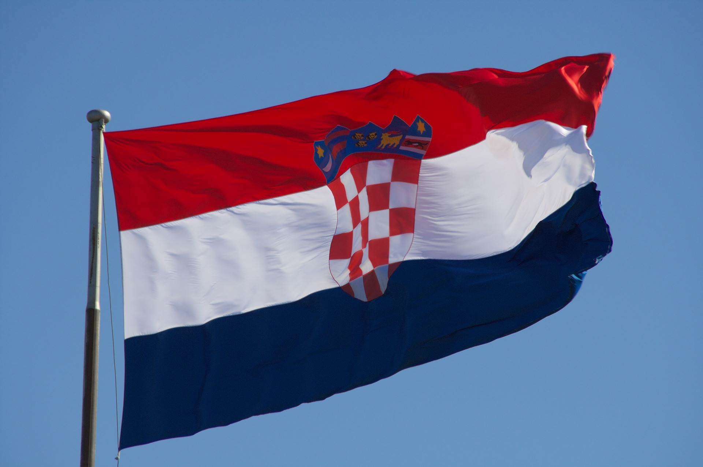
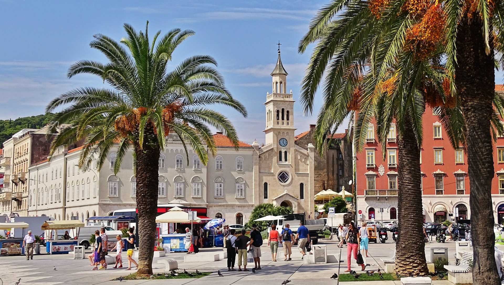

# Croatia

*Source: https://pixabay.com/photos/croatia-flag-croatian-flag-103110/*

## Informations
**Capital City:** Zagreb

**Official language:** Croatian

**Currency:** Croatian Kuna (HRK)

## Beautiful Cities
* Zagreb
* Split
* Rijeka
* Osijek
* Pula

### Picture of Split

*Source: https://pixabay.com/photos/croatia-flag-croatian-flag-103110/*

For more informations click on the link --> [Croatia](https://en.wikipedia.org/wiki/Croatia)