# Befehle
### git config
-  used to query or set configuration options for git
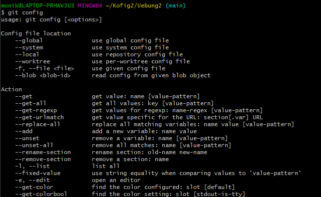
### git init
- to create a new git repository

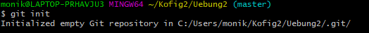
### git commit
- captures a snapshot of the project's current deployed changes

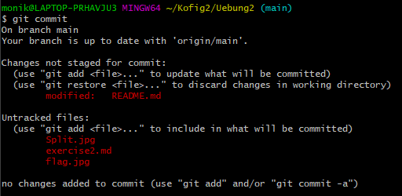
### git status
- returns the status of the working directory and the staging area

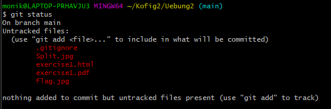
### git add
- to add a change from the working directory to the staging area.

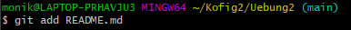

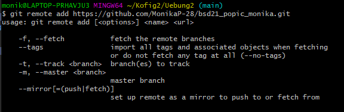

#### add pictures
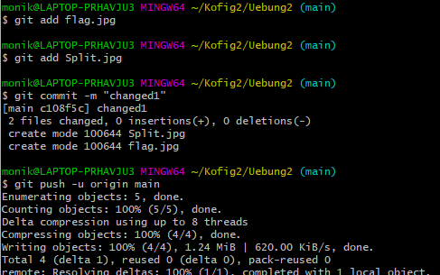
### git log
-  shows a list of all the commits made to a repository

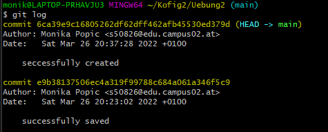
### git diff
-  shows changes in different data sources - these data sources can be commits, branches, files, and more

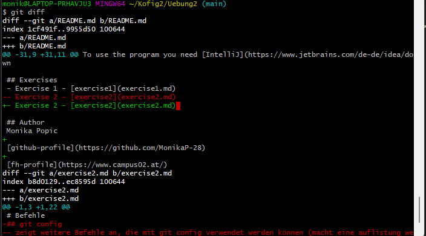
### git pull
- to update the local version of a repository from a remote

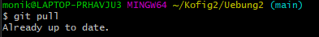
### git push
- to push the commits from your local branch to the remote repository

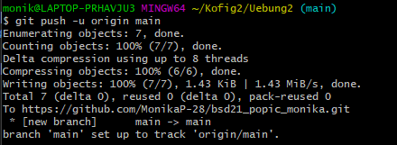