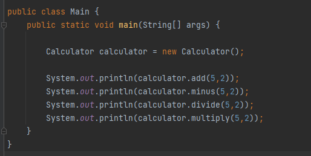
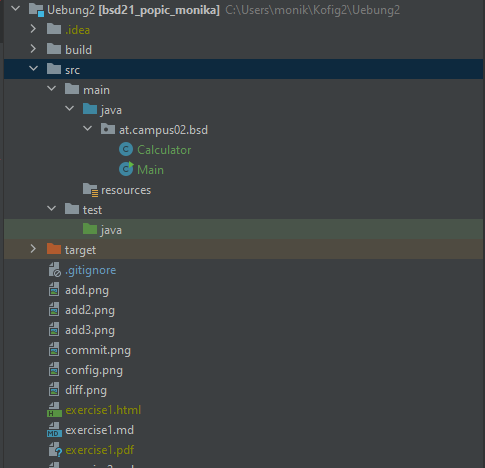
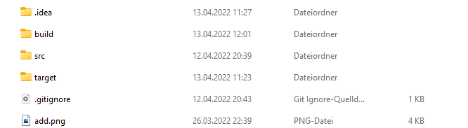
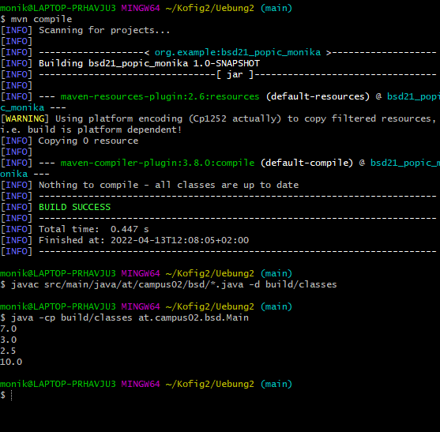

# Calculator
## What does the program do?
Calculator is a program with which you can carry out simple mathematical calculations, with the help of methods.

## Package and Class
The new Java-Class should be saved in a package.

**Creating the package:**

right mouse-click on the java folder --> Package

**Creating the class:**

right mouse-click on the package --> class

## Methods in the Class Calculator
- `add(double number1, double number2)` 
    - enter two values
    - this method adds the two numbers together
- `minus(double number1, double number2)` 
    - enter two values
    - this method subtracts the two numbers
- `divide(double number1, double number2)` 
    - enter two values
    - this method is used to divide the two numbers
- `multiply(double number1, double number2)` 
    - enter two values
    - this method is used to multiply the two numbers

## Main-Class
- created an object of the Claculator-Class
- Methods called with the passed parameters

## Target folder
After running the program for the first time a new folder was created - *Target*

The target directory is used to house all output of the build. 

*Source: https://maven.apache.org/guides/introduction/introduction-to-the-standard-directory-layout.html#:~:text=The%20target%20directory%20is%20used,resources%2C%20site%20and%20so%20on.*

## Build the example in the console
