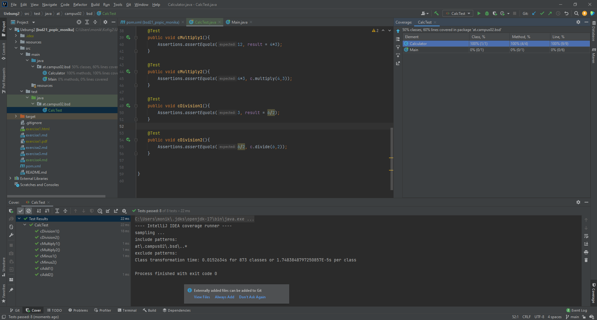
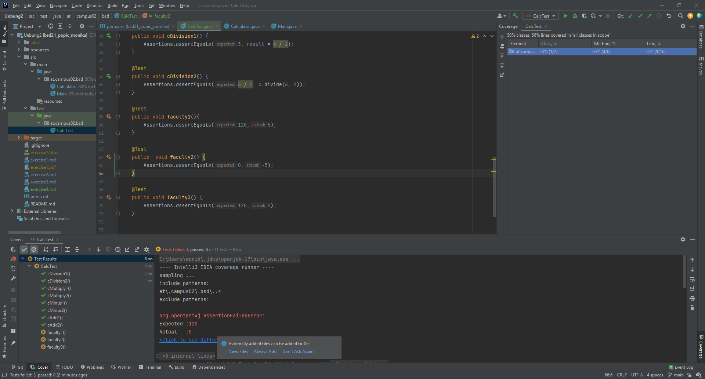

# Calculator
## What does the program do?
Calculator is a program with which you can carry out simple mathematical calculations, with the help of methods.

## Package and Class
The new Java-Class should be saved in a package.

**Creating the package:**

right mouse-click on the java folder --> Package

**Creating the class:**

right mouse-click on the package --> class

## Methods in the Class Calculator
- Testcase cAdd1
- Testcase cAdd2
- Testcase cMinus1
- Testcase cMinus2
- Testcase cMultiply1
- Testcase cMultiply2
- Testcase cDivision1
- Testcase cDivision2

## Description
In the Class CalcTest are testcases to check if the Calculator Class works. The testcases are used for dividing, multiplying, adding and substracting.

## Screenshots

